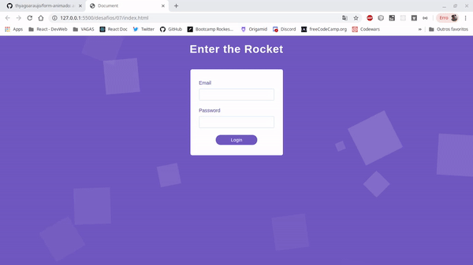

# Formulário animado com JS puro e CSS Animation

### Demo



## Desafios

- [x] Fazer o formulário aparecer, suavemente, quando a página abrir
- [x] Fazer os campos aparecem da esquerda pra direita, suavizando a entrada e fazendo-os entrar em momentos distintos
- [x] Quando clicar em Login, fazer o formulário sair da tela, indo para baixo
- [x] Remover formulário do html e não mostrar rolagem enquanto o formulário está saindo da tela
- [x] Adicionar um efeito diferente de timing para a saída do formulário
- [x] Fazer o formulário dizer não-não (vibrar) caso haja campos vazios.
- [x] Criar alguns quadrados animados (que fiquem girando) e que saem de baixo da tela (fora do campo de visão) e vão para cima da tela (que saia do campo de visão também). _Detalhes_: Deve ter tamanhos diferentes, sairem em momentos diferentes, terem timing diferente, animação contínua.

## :information_source: How To Use

```bash
# Clone this repository
$ git clone https://github.com/thyagoaraujo/form-animado.git

# Go into the repository
$ cd form-animado

# Run the app
$ open index.html
```

## :memo: License

This project is under the MIT license. See the [LICENSE](https://github.com/thyagoaraujo/form-animado/blob/master/LICENSE.md) for more information.

---

Made with ♥ by Thyago Araujo :wave: [Get in touch!](https://www.linkedin.com/in/thyagosantosaraujo/)

## Animation

8 propriedades:

- animation-name: animationname;
- animation-duration: 2s;
- animation-delay: 3s;
- animation-fill-mode: none;
- animation-play-state: running;
- animation-timing-function: ease;
- animation-direction: reverse;
- animation-iteration-count: infinite;

```css
@keyframes animationname {
  0% {
  }

  100% {
  }
}
```

podemos ter múltiplas animações no mesmo elemento

```css
.animate {
  animation: slide-top 2s, bounce 1s, fade 0.2s;
}
```

## References

[CSS Animation Docs](https://developer.mozilla.org/en-US/docs/Web/CSS/CSS_Animations/Using_CSS_animations)

[Animation Timing Docs](https://developer.mozilla.org/en-US/docs/Web/CSS/animation-timing-function)

[Site para criar animações](http://animista.net/play/basic/scale-up)

[Site para criar cubic Bézier timming](https://matthewlein.com/tools/ceaser)
